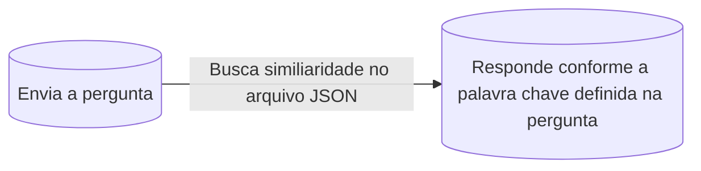

# CHATBOT - BOITATÁ  🐍
  

## Sobre projeto
Foi desenvolvido um chatbot voltado para assuntos relacionados à Física, Ciência de Dados e Tecnologia. O sistema utiliza uma base de conhecimento armazenada em um arquivo JSON, contendo perguntas, palavras-chave e respostas pré-definidas.

O bot é capaz de interagir com os usuários por meio dessas respostas cadastradas, identificando intenções e retornando informações compatíveis com o contexto da conversa. Além disso, sua base de conhecimento pode ser facilmente expandida, bastando adicionar novos conteúdos ao arquivo JSON, sem necessidade de alterar o código-fonte da aplicação. 


## Estrutura do projeto
```text
Bot-Boitata/
│   ├── core/
│   │   ├── main.py             
│   │   └── app.py               
│   ├── json/
│   │   └── intents.json         
│   ├── static/
│   │   ├── style/
│   │   │   └── style.css       
│   │   ├── img/
│   │   │   └── boitata.png      
│   │   └── js/
│   │       └── app.js           
│   └── Templates/
│      └── index.html          
```
## Como utilizar 

### Crie um ambiente

```bash
python3 -m venv ./venv
```
### Ative ambiente 
```bash
source venv/bin/activate
```

## Instale Dependência
```bash
pip install -r requirements.txt
```

# Desativar ambiente (venv)
```bash
deactivate 
```

## Como rodar o projeto 
**Descrição:** Projeto chatbot - boitatá, existem dois tipos de forma de rodar ele, uma delas sendo via terminal ou web, ambos **necessita** ter ambiente ativo. 

Versão terminal
```bash
python3 main.py
```
Versão web
```bash
python3 app.py 
```
## Pipeline sobre projeto
